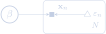
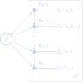
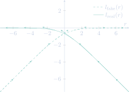

## Abstract

Generative Adversarial Networks (GANs) belong to the class of generative
models and have received a lot of attention recently. GANs are interesting
because they learn to implicitly represent the likelihood function of training
data. This is known to work exceptionally well for image data. A trained GAN
is able to generate samples that look almost realistic. However, the
restriction to an implicit representation means that a GAN can only produce
samples from the likelihood function. A GAN cannot estimate the likelihood
directly. It remains intractable.

...

...

In this Meetup we will take a look at the situation in which a prior
distribution is placed over the weights and biases of the GAN. This is called
a Bayesian GAN in the literature. Bayesian GANs allow for the modelling of
parameter uncertainty. Inferring the posterior distribution for Bayesian GANs
poses new challenges due to the absence of a tractable likelihood. We will
discuss a recent preprint article by Tran et al. (arXiv:1702.08896), in
which an inference method is proposed that is based on variational inference.
The method finds a posterior by fitting the latent variables of a family of
distributions. Since the variational family is implicit, the inferred
posterior will be implicit as well.

### Bayesian Generative Adversarial Networks
## Outline

0. What is a model?

1. What is a GAN?

2. What is a Bayesian GAN?

3. What is a deep implicit model?

4. Inference for deep implicit models

5. A toy model in Edward

### What Is A Model?

Abstract mathematical description of an aspect of the world.

Only valid in a certain regime, and typically under simplifying assumptions.

 

<blockquote>
Essentially, all models are wrong, but some are useful.
</blockquote>

  George E.P. Box

### What Is A GAN?

Basic setup of a Generative Adversarial Network (GAN) is a game between two players:
* The **generator** creates samples from the same distribution as the training data.

* The **discriminator** classifies samples and determines whether they are real or fake.

Training:
* The **discriminator** learns using supervised learning techniques.

* The **generator** learns the distribution of the training data and is trained to fool the discriminator.

### What Is A GAN?

The players are represented by differentiable functions:
* The **discriminator** is a function $d(\\mathbf{x}; \\mathbf{\\theta})$ of samples $\\mathbf{x}$.
* The **generator** is a function $g(\\mathbf{\\varepsilon}; \\mathbf{\\beta})$ taking random $\\mathbf{\\varepsilon} \sim s(\\cdot)$ and turning them into fake samples $\\mathbf{x}$.

There are two cost functions:
* The **discriminator** must minimize $\mathcal{D}(\\mathbf{\\theta}, \\mathbf{\\beta})$ while only varying $\\mathbf{\\theta}.$
* The **generator** must minimize $\mathcal{G}(\\mathbf{\theta}, \\mathbf{\beta})$ while only varying $\\mathbf{\beta}$.

The solution is a Nash equilibrium $(\\mathbf{\\theta}^\*, \\mathbf{\\beta}^\*)$, a tuple where
* $\mathcal{D}$ has a local minimum with respect to $\\mathbf{\\theta}$.
* $\mathcal{G}$ has a local minimum with respect to $\\mathbf{\\beta}$.

### What Is A Bayesian GAN?

In a **GAN**, the generator function $g$ with
$$
  {\\mathbf{x}\_n} = g({\\mathbf{\varepsilon}\_n}| \\mathbf{\beta}), \quad {\\mathbf{\varepsilon}\_n} \sim s(\cdot), \quad n = 1, \\ldots, N,
$$
is an **implicit** representation of a **likelihood** $\color{#ffeb95}{p({\\mathbf{x}\_n} | \\mathbf{\beta})}$ for the observation $\\mathbf{x}\_n$:
$$
  {\\mathbf{x}\_n} \sim \color{#ffeb95}{p(\cdot | \\mathbf{\beta})}.
$$

In a **Bayesian GAN**, we put a **prior** $p(\\mathbf{\beta})$ on the parameters $\\mathbf{\beta}$:
$$
  \\mathbf{\beta} \sim p(\cdot).
$$
This allows for explicit modelling of uncertainties in $\\mathbf{\beta}$.

### What Is A Deep Implicit Model?

Bayesian GAN:
$$
  {\\mathbf{x}\_n} = g({\\mathbf{\varepsilon}\_n}| \\mathbf{\beta}), \quad {\\mathbf{\varepsilon}\_n} \sim s(\cdot), \quad n = 1, \\ldots, N.
$$

Deep **implicit** model with $L + 1$ layers:
$$
  \begin{aligned}
    {\\mathbf{x}\_n} & = g\_0({\\mathbf{\varepsilon}\_{n, 0}}| {\\mathbf{z}\_{n, 1}}, \\mathbf{\beta}), \quad {\\mathbf{\varepsilon}\_{n, 0}} \sim s(\cdot), \\\\[.5em]
    {\\mathbf{z}\_{n, 1}} & = g\_1({\\mathbf{\varepsilon}\_{n, 1}}| {\\mathbf{z}\_{n, 2}}, \\mathbf{\beta}), \quad {\\mathbf{\varepsilon}\_{n, 1}} \sim s(\cdot), \\\\[.5em]
    & \\; \\; \\vdots \\\\
    {\\mathbf{z}\_{n, L-1}} & = g\_{L-1}({\\mathbf{\varepsilon}\_{n, L-1}}| {\\mathbf{z}\_{n, L}}, \\mathbf{\beta}), \quad {\\mathbf{\varepsilon}\_{n, L-1}} \sim s(\cdot), \\\\[.5em]
    {\\mathbf{z}\_{n, L}} & = g\_L({\\mathbf{\varepsilon}\_{n, L}}| \\mathbf{\beta}), \quad {\\mathbf{\varepsilon}\_{n, L}} \sim s(\cdot).
  \end{aligned}
$$
This defines the likelihoods $\color{#ffeb95}{p({\\mathbf{x}\_n} | {\\mathbf{z}\_n}, \\mathbf{\beta})}$ and $\color{#ffeb95}{p({\\mathbf{z}\_n} | \\mathbf{\beta})}$ **implicitly**.

### What Is A Deep Implicit Model?

Bayesian GAN:

  

### What Is A Deep Implicit Model?

Deep **implicit** model with $L + 1$ layers:

  

### What Is A Deep Implicit Model?

Together with the prior for $\\mathbf{\beta}$, a deep **implicit** model defines a hierarchical Bayesian model,
$$
  \color{#ffeb95}{p(\\mathbf{X}, \\mathbf{Z}, \\mathbf{\beta})} = p(\\mathbf{\beta}) \\; {\\prod\_{n = 1}^N} \\; \color{#ffeb95}{p({\\mathbf{x}\_n} | {\\mathbf{z}\_n}, \\mathbf{\beta})} \\, \color{#ffeb95}{p({\\mathbf{z}\_n} | \\mathbf{\beta})}.
$$

Remainder of the talk: Inference or how do we get the **intractable** posterior $\color{#7dc6bf}{p(\\mathbf{Z}, \\mathbf{\beta} | \\mathbf{X})}$?

### Inference For Deep Implicit Models

Instead of **intractable** model posterior $\color{#7dc6bf}{p(\\mathbf{Z}, \\mathbf{\beta} | \\mathbf{X})}$ use **variational approximation** $\color{#ffeb95}{q(\\mathbf{\beta}, \\mathbf{Z} | \\mathbf{X}; \\mathbf{\lambda}, \\mathbf{\phi})}$ with
$$
  \color{#ffeb95}{q(\\mathbf{\beta}, \\mathbf{Z} | \\mathbf{X}; \\mathbf{\lambda}, \\mathbf{\phi})} = q(\\mathbf{\beta} | \\mathbf{X}; \\mathbf{\lambda}) \\; {\\prod\_{n = 1}^N} \\; \color{#ffeb95}{q({\\mathbf{z}\_n} | {\\mathbf{x}\_n}, \\mathbf{\beta}; \\mathbf{\phi})}.
$$
Minimize the **Kullback–Leibler divergence** from $q$ to $p$,
$$
  \\mathrm{KL}\\left(\color{#ffeb95}{q(\\mathbf{\beta}, \\mathbf{Z} | \\mathbf{X}; \\mathbf{\lambda}, \\mathbf{\phi})} \\| \color{#7dc6bf}{p(\\mathbf{Z}, \\mathbf{\beta} | \\mathbf{X})} \\right) \\equiv \\qquad \\qquad
$$
$$
   \\qquad \\qquad \,\\! \mathbb{E}\_{q(\\mathbf{\beta}, \\mathbf{Z} | \\mathbf{X}; \\mathbf{\lambda}, \\mathbf{\phi})} \\left[\\log \\frac{\color{#ffeb95}{q(\\mathbf{\beta}, \\mathbf{Z} | \\mathbf{X}; \\mathbf{\lambda}, \\mathbf{\phi})}}{\color{#7dc6bf}{p(\\mathbf{Z}, \\mathbf{\beta} | \\mathbf{X})}}\\right]
$$
with respect to $\\mathbf{\lambda}$, $\\mathbf{\phi}$ since it measures closeness between $p$ and $q$.

### The Evidence Lower Bound

**Minimization** of $\\mathrm{KL}\\left(\color{#ffeb95}{q(\\mathbf{\beta}, \\mathbf{Z} | \\mathbf{X}; \\mathbf{\lambda}, \\mathbf{\phi})} \\| \color{#7dc6bf}{p(\\mathbf{Z}, \\mathbf{\beta} | \\mathbf{X})} \\right)$ with respect to $\\mathbf{\lambda}$ and $\\mathbf{\phi}$ is not possible, though, because both densities are **intractable**.

**Maximize** the Evidence Lower BOund (ELBO) instead,
$$
  \begin{aligned}
    \mathcal{L}(\\mathbf{\lambda}, \\mathbf{\phi}) & \triangleq \log \color{#7dc6bf}{p(\mathbf{X})} - \\mathrm{KL}\\left(\color{#ffeb95}{q(\\mathbf{\beta}, \\mathbf{Z} | \\mathbf{X}; \\mathbf{\lambda}, \\mathbf{\phi})} \\| \color{#7dc6bf}{p(\\mathbf{Z}, \\mathbf{\beta} | \\mathbf{X})} \\right) \\\\[.5em]
    & = \,\\! \mathbb{E}\_{q(\\mathbf{\beta}, \\mathbf{Z} | \\mathbf{X}; \\mathbf{\lambda}, \\mathbf{\phi})} \\left[\\log \color{#ffeb95}{p(\\mathbf{X}, \\mathbf{Z}, \\mathbf{\beta})} - \log \color{#ffeb95}{q(\\mathbf{\beta}, \\mathbf{Z} | \\mathbf{X}; \\mathbf{\lambda}, \\mathbf{\phi})}\right].
  \end{aligned}
$$

### The Evidence Lower Bound

$$
  \begin{aligned}
    \mathcal{L}(\\mathbf{\lambda}, \\mathbf{\phi}) & = \,\\! \mathbb{E}\_{q(\\mathbf{\beta}, \\mathbf{Z} | \\mathbf{X}; \\mathbf{\lambda}, \\mathbf{\phi})} \\left[\\log \color{#ffeb95}{p(\\mathbf{X}, \\mathbf{Z}, \\mathbf{\beta})} - \log \color{#ffeb95}{q(\\mathbf{\beta}, \\mathbf{Z} | \\mathbf{X}; \\mathbf{\lambda}, \\mathbf{\phi})}\right]
  \end{aligned}
$$
Substitute:
$$
  \begin{aligned}
    \color{#ffeb95}{p(\\mathbf{X}, \\mathbf{Z}, \\mathbf{\beta})} & = {\\textstyle p(\\mathbf{\beta}) \\; {\\prod\_{n = 1}^N} \\; \color{#ffeb95}{p({\\mathbf{x}\_n} | {\\mathbf{z}\_n}, \\mathbf{\beta})} \\, \color{#ffeb95}{p({\\mathbf{z}\_n} | \\mathbf{\beta})}}, \\\\[0.5em]
    \color{#ffeb95}{q(\\mathbf{\beta}, \\mathbf{Z} | \\mathbf{X}; \\mathbf{\lambda}, \\mathbf{\phi})} & =  {\\textstyle q(\\mathbf{\beta} | \\mathbf{X}; \\mathbf{\lambda}) \\; {\\prod\_{n = 1}^N} \\; \color{#ffeb95}{q({\\mathbf{z}\_n} | {\\mathbf{x}\_n}, \\mathbf{\beta}; \\mathbf{\phi})}}.
  \end{aligned}
$$
Get (dependence on $\mathbf{\lambda}$, $\\mathbf{\phi}$ omitted):
$$
  \begin{aligned}
    \mathcal{L} & = \,\\! \mathbb{E}\_{q(\\mathbf{\beta}, \\mathbf{Z} | \\mathbf{X})} \\left[\\log p(\\mathbf{\beta}) - \log q(\\mathbf{\beta} | \\mathbf{X})\right] \\\\[0.5em]
    & \\quad\, + \\sum\_{n=1}^{N} \,\\! \mathbb{E}\_{q(\\mathbf{\beta}, {\\mathbf{z}\_n} | \\mathbf{X})} \\left[\\log \color{#ffeb95}{p({\\mathbf{x}\_n}, {\\mathbf{z}\_n} | \\mathbf{\beta})} - \log \color{#ffeb95}{q({\\mathbf{z}\_n} | {\\mathbf{x}\_n}, \\mathbf{\beta})}\right]
  \end{aligned}
$$

### Ratio Estimation

Subtract the constant **empirical distribution** on the observations $\mathbf{X},$ $\\log q(\mathbf{X}) = \\sum\_{n=1}^N \\log q({\mathbf{x}\_n})$, from the latter term:
$$
  \\sum\_{n=1}^{N} \\left\\{\,\\! \mathbb{E}\_{q(\\mathbf{\beta}, {\\mathbf{z}\_n} | \\mathbf{X})} \\left[\\log \color{#ffeb95}{p({\\mathbf{x}\_n}, {\\mathbf{z}\_n} | \\mathbf{\beta})} - \log \color{#ffeb95}{q({\\mathbf{z}\_n} | {\\mathbf{x}\_n}, \\mathbf{\beta})}\right] - \\log q({\mathbf{x}\_n}) \\right\\}.
$$
Substitute $\color{#ffeb95}{q({\mathbf{x}\_n}, {\mathbf{z}\_n} | \mathbf{\beta})} \\equiv q({\mathbf{x}\_n}) \, \color{#ffeb95}{q({\mathbf{z}\_n} | {\mathbf{x}\_n}, \mathbf{\beta})}$ and $\color{#ffeb95}{q(\mathbf{\beta}, {\mathbf{z}\_n} | \mathbf{X})} = q(\mathbf{\beta} | \mathbf{X}) \, \color{#ffeb95}{q({\mathbf{z}\_n} | {\mathbf{x}\_n}, \mathbf{\beta})}$:
$$
  \\sum\_{n=1}^{N} \,\\! \mathbb{E}\_{q(\mathbf{\beta} | \mathbf{X}) \, q({\mathbf{z}\_n} | {\mathbf{x}\_n}, \mathbf{\beta})} \\left[\\log \\frac{\color{#ffeb95}{p({\mathbf{x}\_n}, {\mathbf{z}\_n}| \mathbf{\beta})}}{\color{#ffeb95}{q({\mathbf{x}\_n}, {\mathbf{z}\_n}| \mathbf{\beta})}}\\right].
$$
We are going to estimate the log-ratio $\log (\color{#ffeb95}{p(\cdot|\mathbf{\beta})} / \color{#ffeb95}{q(\cdot|\mathbf{\beta})})$.

### The New Evidence Lower Bound

Once we have an estimate of the log-ratio, $r({\mathbf{x}\_n}, {\mathbf{z}\_n}, \mathbf{\beta}) \simeq \log (\color{#ffeb95}{p(\cdot|\mathbf{\beta})} / \color{#ffeb95}{q(\cdot|\mathbf{\beta})})$, we can maximize the new ELBO:
$$
  \begin{aligned}
    \mathcal{L} & \propto \,\\! \mathbb{E}\_{q(\\mathbf{\beta}, \\mathbf{Z} | \\mathbf{X})} \\left[\\log p(\\mathbf{\beta}) - \log q(\\mathbf{\beta} | \\mathbf{X})\right] \\\\[0.5em]
    & \\quad\, + \\sum\_{n=1}^{N} \,\\! \mathbb{E}\_{q(\mathbf{\beta} | \mathbf{X}) \, q({\mathbf{z}\_n} | {\mathbf{x}\_n}, \mathbf{\beta})} \\left[r({\mathbf{x}\_n}, {\mathbf{z}\_n}, \mathbf{\beta})\\right].
  \end{aligned}
$$

But we are not there yet.

### Back to Ratio Estimation

Use a GAN-style algorithm:
* Given a sample from $\color{#ffeb95}{p(\cdot)}$ ("fake") or $\color{#ffeb95}{q(\cdot)}$ ("real"), we seek to **estimate the probability** that it was drawn from $\color{#ffeb95}{p(\cdot)}$ ("fake"):
  * High probability: "fake" (from $\color{#ffeb95}{p}$).
  * Low probability: "real" (from $\color{#ffeb95}{q}$).

* Model this using $\sigma(r(\cdot; \mathbf{\theta}))$, where:
  * $r$ is a **GAN-like discrepancy function**.
  * $\mathbf{\theta}$ are the parameters of $r$.
  * $\sigma(r) = (1 + {\mathrm{e}^{-r}})^{-1}$ is the logistic function that transforms the output of $r$ such that it is in $(0,1)$.

### Negative Loss Function

Train estimator $r(\cdot; \mathbf{\theta})$ by **maximizing** a negative loss function,
$$
  \begin{aligned}
    \mathcal{D} & = \,\\! \mathbb{E}\_{p({\mathbf{x}\_n}, {\mathbf{z}\_n} | \mathbf{\beta})} \\left[l\_{\text{fake}}(r({\mathbf{x}\_n}, {\mathbf{z}\_n}, \mathbf{\beta}; \mathbf{\theta}))\\right] \\\\[.5em]
    & \quad \, + \,\\! \mathbb{E}\_{q({\mathbf{x}\_n}, {\mathbf{z}\_n} | \mathbf{\beta})} \\left[l\_{\text{real}}(r({\mathbf{x}\_n}, {\mathbf{z}\_n}, \mathbf{\beta}; \mathbf{\theta}))\\right]
  \end{aligned}
$$
with
$$
  \begin{aligned}
    l\_{\text{fake}}(r) & = \log \sigma(r) = - \log(1 + {\mathrm{e}^{-r}}) \equiv \mathrm{softminus}(r), \\\\[0.5em]
    l\_{\text{real}}(r) & = \log (1 - \sigma(r)) = - \log(1 + {\mathrm{e}^{r}}) \equiv - \mathrm{softplus}(r).
  \end{aligned}
$$

Thus:
* $r$ is encouraged to be **large** when sample is "fake" (from $\color{#ffeb95}{p}$).
* $r$ is encouraged to be **small** when sample is "real" (from $\color{#ffeb95}{q}$).

### Negative Loss Function

  

* $r$ is encouraged to be **large** when sample is "fake" (from $\color{#ffeb95}{p}$).
* $r$ is encouraged to be **small** when sample is "real" (from $\color{#ffeb95}{q}$).

### Why Does This Work? 

Why does maximizing $\mathcal{D}$ with respect to $r$ give us an estimator for the log-ratio $\log (\color{#ffeb95}{p(\cdot|\mathbf{\beta})} / \color{#ffeb95}{q(\cdot|\mathbf{\beta})})$? Consider:
$$
  \mathcal{D}[r] = \,\\! \mathbb{E}\_{x \sim p} \\left[\mathrm{softminus}(r(x))\\right] - \,\\! \mathbb{E}\_{x \sim q} \\left[\mathrm{softplus}(r(x))\\right].
$$
Pretend we can solve the maximization problem in function space:
$$
  \begin{aligned}
    0 = \frac{\delta}{\delta r(x)} \mathcal{D} & = p(x) \left[\frac{\mathrm{d}}{\mathrm{d} s} \mathrm{softminus}(s)\right]\_{s = r(x)} \\\\[1.5em]
    & \qquad \, - q(x) \left[\frac{\mathrm{d}}{\mathrm{d} s} \mathrm{softplus}(s)\right]\_{s = r(x)} \\\\[1.5em]
    & = \frac{1}{1+{\mathrm{e}^{r(x)}}} \, \\left\\{p(x) - q(x) \, {\mathrm{e}^{r(x)}}\\right\\}
  \end{aligned}
$$

### Why Does This Work?

What's the **optimal function**? It's the solution of
$$
  0 = p(x) - q(x) \, {\mathrm{e}^{r(x)}},
$$
that is: $r^{\*}(x) = \log (p(x) / q(x))$ for $q(x) > 0$ or
$$
  \color{#ffeb95}{r^{\*}({\mathbf{x}\_n}, {\mathbf{z}\_n}, \mathbf{\beta}; \mathbf{\lambda}, \mathbf{\phi}))} = \log \frac{\color{#ffeb95}{p({\mathbf{x}\_n}, {\mathbf{z}\_n} | \mathbf{\beta})}}{\color{#ffeb95}{q({\mathbf{x}\_n}, {\mathbf{z}\_n} | \mathbf{\beta}; \mathbf{\lambda}, \mathbf{\phi})}}.
$$

Thus we can **use our estimate $r(\cdot; \mathbf{\theta})$ as a proxy to the log-ratio**!

This is possible as long as the family $r(\cdot; \mathbf{\theta})$ is expressive enough to come close to the optimal function $\color{#ffeb95}{r^{\*}({\mathbf{x}\_n}, {\mathbf{z}\_n}, \mathbf{\beta}; \mathbf{\lambda}, \mathbf{\phi}))}$.

### Gradient of $\mathcal{D}$ with Respect to $\mathbf{\theta}$

$$
  \begin{aligned}
    {{\mathbf{\nabla}}\_{\mathbf{\theta}}} \mathcal{D}(\mathbf{\theta}) & = \,\\! \mathbb{E}\_{p({\mathbf{x}\_n}, {\mathbf{z}\_n} | \mathbf{\beta})} \\left[{{\mathbf{\nabla}}\_{\mathbf{\theta}}} \, l\_{\text{fake}}(r({\mathbf{x}\_n}, {\mathbf{z}\_n}, \mathbf{\beta}; \mathbf{\theta}))\\right] \\\\[.5em]
    & \quad \, + \,\\! \mathbb{E}\_{q({\mathbf{x}\_n}, {\mathbf{z}\_n} | \mathbf{\beta})} \\left[{{\mathbf{\nabla}}\_{\mathbf{\theta}}} \, l\_{\text{real}}(r({\mathbf{x}\_n}, {\mathbf{z}\_n}, \mathbf{\beta}; \mathbf{\theta}))\\right]
  \end{aligned}
$$

### Maximizing The ELBO

$$
  \begin{aligned}
    \mathcal{L}(\mathbf{\phi}, \mathbf{\lambda}, \mathbf{\theta}) & \propto \,\\! \mathbb{E}\_{q(\\mathbf{\beta}, \\mathbf{Z} | \\mathbf{X}; \mathbf{\lambda})} \\left[\\log p(\\mathbf{\beta}) - \log q(\\mathbf{\beta} | \\mathbf{X}; \mathbf{\lambda})\right] \\\\[0.5em]
    & \\quad\, + \\sum\_{n=1}^{N} \,\\! \mathbb{E}\_{q(\mathbf{\beta} | \mathbf{X}; \mathbf{\lambda}) \, q({\mathbf{z}\_n} | {\mathbf{x}\_n}, \mathbf{\beta}; \mathbf{\phi})} \\left[r({\mathbf{x}\_n}, {\mathbf{z}\_n}, \mathbf{\beta}; \mathbf{\theta})\\right].
  \end{aligned}
$$

Needed gradients for SGA: ${{\mathbf{\nabla}}\_{\mathbf{\phi}}} \mathcal{L}$, ${{\mathbf{\nabla}}\_{\mathbf{\lambda}}} \mathcal{L}$.

**Problem**: $\mathbf{\phi}$ and $\mathbf{\lambda}$ are appearing in the **probability measures** $q(\cdot)$ of the expectation values $\mathbb{E}\_{q(\cdot)}$.

**Solution**: Use a differentiable transformation $T$ to move $\mathbf{\phi}$ and $\mathbf{\lambda}$ out of these measures.

### Maximizing The ELBO

$$
  \begin{aligned}
    \mathcal{L}(\mathbf{\phi}, \mathbf{\lambda}, \mathbf{\theta}) & \propto \,\\! \mathbb{E}\_{q(\\mathbf{\beta}, \\mathbf{Z} | \\mathbf{X}; \mathbf{\lambda})} \\left[\\log p(\\mathbf{\beta}) - \log q(\\mathbf{\beta} | \\mathbf{X}; \mathbf{\lambda})\right] \\\\[0.5em]
    & \\quad\, + \\sum\_{n=1}^{N} \,\\! \mathbb{E}\_{q(\mathbf{\beta} | \mathbf{X}; \mathbf{\lambda}) \, q({\mathbf{z}\_n} | {\mathbf{x}\_n}, \mathbf{\beta}; \mathbf{\phi})} \\left[r({\mathbf{x}\_n}, {\mathbf{z}\_n}, \mathbf{\beta}; \mathbf{\theta})\\right].
  \end{aligned}
$$

Global and local transformations:
1. $\,\\! \mathbb{E}\_{q(\mathbf{\beta} | \mathbf{X}; \mathbf{\lambda})} \left[f(\mathbf{\beta})\right] \to \,\\! \mathbb{E}\_{\mathcal{\delta}\_{\mathrm{global}} \sim s(\cdot)} \left[f\left(\mathbf{T}\_{\mathrm{global}}(\mathbf{\delta}\_{\mathrm{global}}; \mathbf{\lambda})\right)\right]$,

2. $\,\\! \mathbb{E}\_{q({\mathbf{z}\_n} | {\mathbf{x}\_n}, \mathbf{\beta}; \mathbf{\phi})} \left[h({\mathbf{z}\_n})\right] \to \,\\! \mathbb{E}\_{\mathcal{\delta}\_{\mathrm{local}} \sim s(\cdot)} \left[h\left(\mathbf{T}\_{\mathrm{local}}(\mathbf{\delta}\_{\mathrm{local}}, {\mathbf{x}\_n}; \mathbf{\phi})\right)\right]$.

Example: $s(\cdot)$ is, say, a standard multivariate normal distribution. $\mathbf{T}$ can then be used to map this to a multivariate normal distribution with location $\mathbf{\mu}$ and covariance $\mathbf{\Sigma}$.

### Gradient of $\mathcal{L}$ with Respect to $\mathbf{\phi}$ And $\mathbf{\lambda}$

$$
  \begin{aligned}
    {{\mathbf{\nabla}}\_{\mathbf{\phi}}} \mathcal{L} & = {\sum\_{n=1}^N} \; \mathbb{E}\_{q(\mathbf{\beta} | \mathbf{X}; \mathbf{\lambda})} \left[\mathbb{E}\_{\mathbf{\delta}\_{\text{local}} \sim s(\cdot)}\left[{{\mathbf{\nabla}}\_{\mathbf{\phi}}} \, r({\mathbf{x}\_n}, {\mathbf{z}\_n}, \mathbf{\beta}; \mathbf{\theta})\right]\right], \\\\[3em]
    {{\mathbf{\nabla}}\_{\mathbf{\lambda}}} \mathcal{L} & = \,\\! \mathbb{E}\_{\mathcal{\delta}\_{\mathrm{global}} \sim s(\cdot)} \left[{{\mathbf{\nabla}}\_{\mathbf{\lambda}}} \left(\log p(\mathbf{\beta}) - \log q(\mathbf{\beta} | \mathbf{X}; \mathbf{\lambda})\right)\right] \\\\[.5em]
    & \quad \, + {\sum\_{n=1}^N} \; \mathbb{E}\_{\mathcal{\delta}\_{\mathrm{global}} \sim s(\cdot)} \left[\mathbb{E}\_{q(\mathbf{z}\_n|{\mathbf{x}\_n}, \mathbf{\beta}; \mathbf{\phi})} \left[{{\mathbf{\nabla}}\_{\mathbf{\lambda}}} \, r({\mathbf{x}\_n}, {\mathbf{z}\_n}, \mathbf{\beta}; \mathbf{\theta})\right]\right].
  \end{aligned}
$$

### The Finished Algorithm

**Input**:
* **Model**: **implicit** likelihood $\color{#ffeb95}{p(\mathbf{X}, \mathbf{Z} | \mathbf{\beta})}$, tractable prior $p(\mathbf{\beta})$.
* **Variational approximation family**: **implicit** likelihood $\color{#ffeb95}{q({\mathbf{z}\_n} | {\mathbf{x}\_n}, \mathbf{\beta}; \mathbf{\phi})}$, tractable prior $q(\mathbf{\beta} | \mathbf{X}; \mathbf{\lambda})$.
* **Ratio estimate**: $r(\cdot; \mathbf{\theta})$.

**Output**: Variational parameters $\mathbf{\phi}$ and $\mathbf{\lambda}$.

**Algorithm**:
* Initialize $\mathbf{\phi}$, $\mathbf{\lambda}$, and $\mathbf{\theta}$ randomly.
* While not converged do:
  * Compute unbiased estimates of ${{\mathbf{\nabla}}\_{\mathbf{\theta}}} \mathcal{D}(\mathbf{\theta})$, ${{\mathbf{\nabla}}\_{\mathbf{\phi}}} \mathcal{L}$, and ${{\mathbf{\nabla}}\_{\mathbf{\lambda}}} \mathcal{L}$.
  * Update $\mathbf{\phi}$, $\mathbf{\lambda}$, and $\mathbf{\theta}$ using SGA.
* End.

### Can I Use This?

Bayesian GANs and GAN-style inference are available in [**Edward**](http://edwardlib.org).

### Where Can I Read More About This?

Tran et al., **Deep and Hierarchical Implicit Models**, [arXiv:1702.08896](https://arxiv.org/abs/1702.08896)

Tran et al., **Deep Probabilistic Programming**, [arXiv:1701.03757](https://arxiv.org/abs/1701.03757)

Mescheder et al., **Adversarial Variational Bayes: Unifying Variational Autoencoders and Generative Adversarial Networks**, [arXiv:1701.04722](https://arxiv.org/abs/1701.04722)

F. Huszár, **Variational Inference using Implicit Distributions**, [arXiv:1702.08235 ](https://arxiv.org/abs/1702.08235)

Goodfellow et al., **Generative Adversarial Nets**, [arXiv:1406.2661](https://arxiv.org/abs/1406.2661)

I. Goodfellow, **Generative Adversarial Networks**, [arXiv:1701.00160](https://arxiv.org/abs/1701.00160), [NIPS 2016 Tutorial](https://nips.cc/Conferences/2016/Schedule?showEvent=6202)

Blei et al., **Variational Inference: Foundations and Modern Methods**, [NIPS 2016 Tutorial](https://nips.cc/Conferences/2016/Schedule?showEvent=6199)
